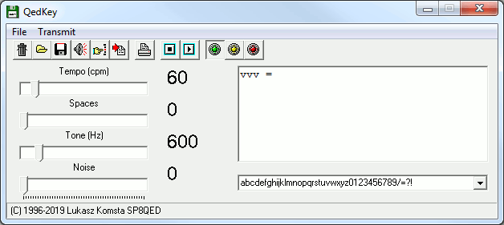

# QedKey

&nbsp;

&nbsp;

Vintage CW training software, developed originally in Delphi 3 in mid 1990s.

After several years I have started a new portable project in C called [CWStudio](http://cwstudio.sourceforge.net/) and abandoned QedKey.

Time passed, but it was still being used by many people for learning CW. Therefore I cleaned up the last available version (I lost source code of the newest one), recompiled in Delphi 3 and [released with the source under MIT license](http://goo.gl/0p359F).

As it is still downloaded in 2019, the decision was to convert it to Lazarus and create this repository.

I will put all effort to develop CWStudio, so I do not plan any enhancements. My commits into this repository will be limited to make this software available on all platforms supported by Lazarus.

However, the idea of placing it here is to allow any interested programmer to commit own contributions, allowing QedKey to live its own life.

Releases will be versioned with a year number and a small letter (2019a etc.)
